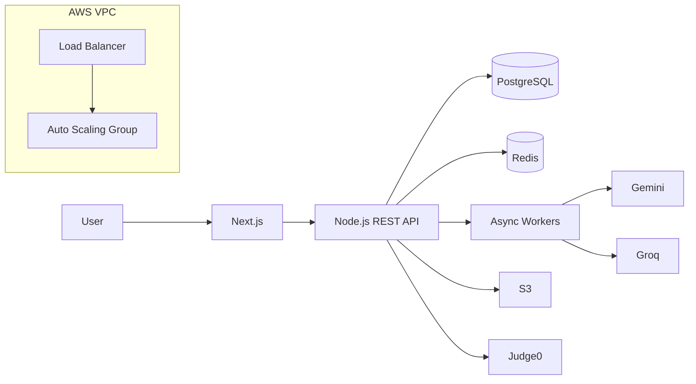
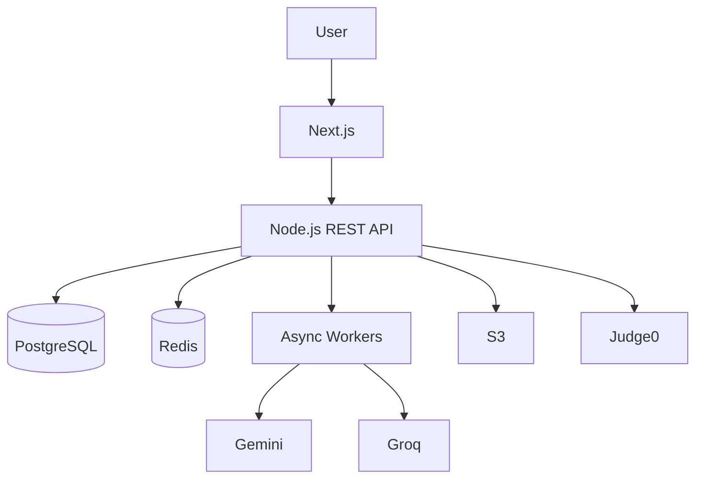

````markdown
<div align="center">

# Sachin Kumar

### Full-Stack Developer · Computer Science Student

Building full-stack applications, practicing DSA in C++, and getting deeper into backend architecture and cloud deployment.

[](https://github.com/sachinsharmaa07)
[](https://linkedin.com/in/sachinsharmaa07/)
[](https://leetcode.com/u/sachinsharmaa07/)
[](https://portfolio-wheat-delta-70.vercel.app/)

</div>

---

<p align="center">

<a href="#about">About</a> ·
<a href="#currently-building">Currently Building</a> ·
<a href="#tech-stack">Stack</a> ·
<a href="#featured-projects">Projects</a> ·
<a href="#architecture">Architecture</a> ·
<a href="#dsa">DSA</a> ·
<a href="#credentials">Credentials</a> ·
<a href="#education">Education</a> ·
<a href="#contact">Contact</a>

</p>

---

## About

I'm a **B.Tech Computer Science and Engineering student at Lovely Professional University** with a **CGPA of 8.2**, currently preparing for software engineering placements.

I build full-stack applications with **React, Next.js, Node.js, PostgreSQL and MongoDB**, while practicing DSA primarily in **C++**.

My current focus is on **backend architecture, REST APIs, authentication, databases, caching, asynchronous processing, system design, AWS, Docker and CI/CD**.

---

## Currently Building

```text
FULL-STACK
React · Next.js · Node.js · Express

BACKEND
REST APIs · JWT · RBAC · Socket.IO
Caching · Rate Limiting · Async Processing

DATABASES
PostgreSQL · MongoDB · MySQL · Redis

CLOUD / DEVOPS
AWS · Docker · GitHub Actions · Vercel · Render

PLACEMENT PREP
DSA · C++ · DBMS · OOP · System Design
```

---

# Tech Stack

### Languages

[C++](https://isocpp.org/) ·
[JavaScript](https://developer.mozilla.org/en-US/docs/Web/JavaScript) ·
[Java](https://www.oracle.com/java/) ·
[C](https://en.cppreference.com/w/c) ·
[Python](https://www.python.org/) ·
[SQL](https://en.wikipedia.org/wiki/SQL)

### Frontend

[React](https://react.dev/) ·
[Next.js](https://nextjs.org/) ·
[Tailwind](https://tailwindcss.com/) ·
[HTML](https://developer.mozilla.org/en-US/docs/Web/HTML) ·
[CSS](https://developer.mozilla.org/en-US/docs/Web/CSS)

### Backend

[Node.js](https://nodejs.org/) ·
[Express](https://expressjs.com/) ·
[REST APIs](https://developer.mozilla.org/en-US/docs/Glossary/REST) ·
[Socket.IO](https://socket.io/) ·
[JWT](https://jwt.io/)

### Databases

[PostgreSQL](https://www.postgresql.org/) ·
[MongoDB](https://www.mongodb.com/) ·
[MySQL](https://www.mysql.com/) ·
[Redis](https://redis.io/)

### Cloud & DevOps

[AWS](https://aws.amazon.com/) ·
[Docker](https://www.docker.com/) ·
[GitHub Actions](https://github.com/features/actions) ·
[Vercel](https://vercel.com/) ·
[Render](https://render.com/)

### Engineering

`DSA` · `OOP` · `DBMS` · `System Design` · `CI/CD` ·
`Database Indexing` · `Asynchronous Processing` · `LLM Integration`

---

# Featured Projects

Projects are the main representation of my engineering work.

---

## 🚀 [PrepPal — Placement Preparation & Hiring Platform](https://github.com/sachinsharmaa07/PrepPal)

**AI-powered placement platform combining DSA practice, resume analysis, mock interviews and recruiter workflows.**

### What I built

- **300+ DSA problems** aggregated from LeetCode, GeeksforGeeks and other platforms
- AI resume / ATS analysis
- Adaptive mock interviews
- Recruiter job posting

### Engineering

- Modular monolith architecture
- Next.js frontend
- Node.js REST API
- PostgreSQL with indexed relational models
- Full-text search
- Redis caching
- Rate limiting
- Async workers for resume and AI processing

### AI Layer

- [Gemini](https://ai.google.dev/) integration
- [Groq](https://groq.com/) fallback provider
- Provider-fallback abstraction
- Deterministic ATS scoring

### Infrastructure

- AWS VPC
- Public / private subnets
- Load Balancer
- Auto Scaling Group
- Secure S3 uploads
- [Judge0](https://judge0.com/) sandboxed code execution
- Vercel / Render / AWS deployment

<details>
<summary><strong>Architecture</strong></summary>



</details>

**Stack:** `Next.js` `React` `Node.js` `PostgreSQL` `Redis` `AWS` `Docker` `JWT`

**[View Repository →](https://github.com/sachinsharmaa07/PrepPal)**

---

## 🏋️ [Akhada Analytics — Fitness Intelligence Platform](https://github.com/sachinsharmaa07/Akhada-Anlaytics)

**Mobile-first MERN platform for workout tracking, nutrition and body analytics.**

**[Live Demo →](https://akhada-analytics.vercel.app/login)**

### Features

- Workout logging
- Nutrition tracking
- Body analytics
- **900+ item** multi-cuisine food database
- Interactive Muscle Heatmap
- 7-day frequency visualization
- Automatic Personal Record detection
- Pre-built workout programs

### Engineering

- JWT dual-token authentication
- Google OAuth
- MongoDB Atlas
- Helmet security middleware
- Rate limiting
- bcrypt with 12 rounds
- Token-reuse detection

### Infrastructure

- Vercel
- Render
- AWS
- AWS VPC
- Public / private subnets
- Load Balancer
- Auto Scaling Group

<details>
<summary><strong>Technical highlights</strong></summary>

The application combines a MERN stack with authentication, database-backed analytics, security middleware and cloud deployment.

The Muscle Heatmap and 7-day frequency visualization turn workout history into a compact training view, while automatic PR detection evaluates workout logs for personal records.

</details>

**Stack:** `React` `Node.js` `Express` `MongoDB` `JWT` `Google OAuth` `Vercel` `Render`

**[Repository →](https://github.com/sachinsharmaa07/Akhada-Anlaytics)** · **[Live Demo →](https://akhada-analytics.vercel.app/login)**

---

# Architecture

One of the things I enjoy most is understanding what happens beyond the UI.

For PrepPal, the application flow can be summarized as:



### Infrastructure

```text
AWS VPC
│
├── Public Subnets
│   └── Load Balancer
│
└── Private Subnets
    └── Auto Scaling Group
```

The interesting engineering layer is around the application itself:

`Indexed Models` → `Caching` → `Rate Limiting` → `Async Processing` → `Authentication` → `AI Provider Fallback` → `Cloud Deployment`

---

# DSA

### 300+ Problems Solved

I practice DSA primarily in **C++** across:

[LeetCode](https://leetcode.com/u/sachinsharmaa07/) ·
GeeksforGeeks · other coding platforms

```text
Arrays
Linked Lists
Stacks
Queues
Trees
Graphs
```

### Milestone

**LeetCode 100-Day Badge — 2026**

**[View LeetCode Profile →](https://leetcode.com/u/sachinsharmaa07/)**

---

# Credentials

### Certifications

**Cloud Computing**  
[NPTEL · IIT Kharagpur](https://nptel.ac.in/) · Apr 2025

**ChatGPT-4 Prompt Engineering — Generative AI & LLM**  
Jul 2025

### Training

**Certificate of Merit — DSA Summer Training**  
Centre for Professional Enhancement · Jul 2025

### Achievement

**300+ DSA problems solved** across LeetCode, GeeksforGeeks and other coding platforms.

**LeetCode 100-Day Badge — 2026**

---

# Education

### Lovely Professional University

**Bachelor of Technology — Computer Science and Engineering**

Punjab, India

**CGPA:** 8.2  
**Since:** Aug 2023

---

# Contact

I'm easiest to reach through the links below.

| Platform | Link |
|---|---|
| GitHub | [github.com/sachinsharmaa07](https://github.com/sachinsharmaa07) |
| LinkedIn | [linkedin.com/in/sachinsharmaa07](https://linkedin.com/in/sachinsharmaa07/) |
| LeetCode | [leetcode.com/u/sachinsharmaa07](https://leetcode.com/u/sachinsharmaa07/) |
| Portfolio | [portfolio-wheat-delta-70.vercel.app](https://portfolio-wheat-delta-70.vercel.app/) |
| Email | [studentgroup479@gmail.com](mailto:studentgroup479@gmail.com) |

---

<div align="center">

[GitHub](https://github.com/sachinsharmaa07) ·
[LinkedIn](https://linkedin.com/in/sachinsharmaa07/) ·
[LeetCode](https://leetcode.com/u/sachinsharmaa07/) ·
[Portfolio](https://portfolio-wheat-delta-70.vercel.app/)

<br>

<sub>Build. Solve. Deploy. Repeat.</sub>

</div>
````
