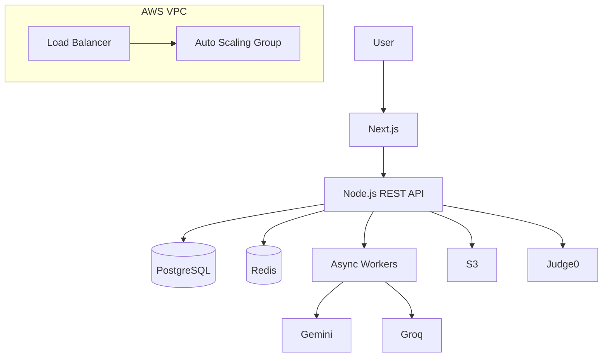
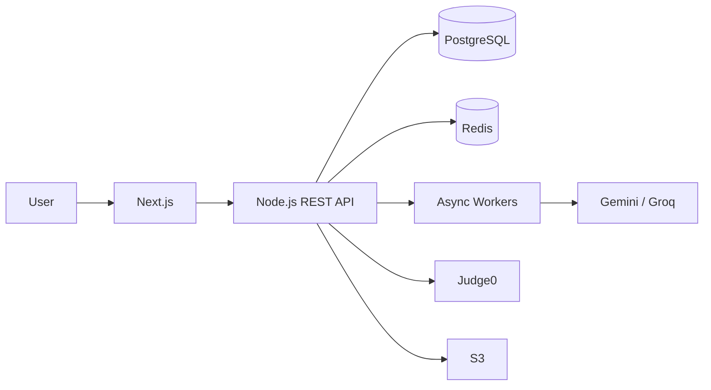

<div align="center">

# Sachin Kumar

### Full-Stack Developer · Computer Science Student

Building full-stack applications, practicing DSA in C++, and exploring backend architecture, cloud infrastructure, and deployment.

<p>
  <a href="https://github.com/sachinsharmaa07">
    
  </a>
  <a href="https://linkedin.com/in/sachinsharmaa07/">
    
  </a>
  <a href="https://leetcode.com/u/sachinsharmaa07/">
    
  </a>
  <a href="https://portfolio-wheat-delta-70.vercel.app/">
    
  </a>
</p>

</div>

---

<div align="center">

<a href="#about">About</a> ·
<a href="#currently-building">Currently Building</a> ·
<a href="#tech-stack">Tech Stack</a> ·
<a href="#featured-projects">Projects</a> ·
<a href="#architecture">Architecture</a> ·
<a href="#dsa">DSA</a> ·
<a href="#credentials">Credentials</a> ·
<a href="#education">Education</a> ·
<a href="#contact">Contact</a>

</div>

---

## About

I'm a **B.Tech Computer Science and Engineering student at [Lovely Professional University](https://www.lpu.in/)** with a **CGPA of 8.2**, currently preparing for software engineering placements.

I build full-stack applications using **React, Next.js, Node.js, PostgreSQL and MongoDB**, while practicing DSA primarily in **C++**.

My current engineering focus is on **REST APIs, authentication, databases, caching, asynchronous processing, system design, AWS, Docker and CI/CD**.

---

## Currently Building

```text
FULL-STACK
React · Next.js · Node.js · Express

BACKEND
REST APIs · JWT · RBAC · Socket.IO
Caching · Rate Limiting · Async Processing

DATABASES
PostgreSQL · MongoDB · MySQL · Redis

CLOUD & DEVOPS
AWS · Docker · GitHub Actions · Vercel · Render

PLACEMENT PREPARATION
DSA · C++ · DBMS · OOP · System Design
```

---

# Tech Stack

### Languages

<a href="https://isocpp.org/">C++</a> ·
<a href="https://developer.mozilla.org/en-US/docs/Web/JavaScript">JavaScript</a> ·
<a href="https://www.oracle.com/java/">Java</a> ·
<a href="https://en.cppreference.com/w/c">C</a> ·
<a href="https://www.python.org/">Python</a> ·
<a href="https://en.wikipedia.org/wiki/SQL">SQL</a>

### Frontend

<a href="https://react.dev/">React</a> ·
<a href="https://nextjs.org/">Next.js</a> ·
<a href="https://tailwindcss.com/">Tailwind</a> ·
<a href="https://developer.mozilla.org/en-US/docs/Web/HTML">HTML</a> ·
<a href="https://developer.mozilla.org/en-US/docs/Web/CSS">CSS</a>

### Backend

<a href="https://nodejs.org/">Node.js</a> ·
<a href="https://expressjs.com/">Express</a> ·
<a href="https://developer.mozilla.org/en-US/docs/Glossary/REST">REST APIs</a> ·
<a href="https://socket.io/">Socket.IO</a> ·
<a href="https://jwt.io/">JWT</a>

### Databases

<a href="https://www.postgresql.org/">PostgreSQL</a> ·
<a href="https://www.mongodb.com/">MongoDB</a> ·
<a href="https://www.mysql.com/">MySQL</a> ·
<a href="https://redis.io/">Redis</a>

### Cloud & DevOps

<a href="https://aws.amazon.com/">AWS</a> ·
<a href="https://www.docker.com/">Docker</a> ·
<a href="https://github.com/features/actions">GitHub Actions</a> ·
<a href="https://vercel.com/">Vercel</a> ·
<a href="https://render.com/">Render</a>

### Engineering Concepts

`DSA` ·
`OOP` ·
`DBMS` ·
`System Design` ·
`CI/CD` ·
`Database Indexing` ·
`Asynchronous Processing` ·
`LLM Integration` ·
`JWT / RBAC Authentication & Authorization`

---

# Featured Projects

The projects below are the main representation of my engineering work.

---

## 🚀 PrepPal — Placement Preparation & Hiring Platform

**AI-powered placement platform combining DSA practice, resume analysis, mock interviews and recruiter workflows.**

### Links

**[Repository →](https://github.com/sachinsharmaa07/PrepPal)**

### What I Built

- **300+ DSA problems** aggregated from LeetCode, GeeksforGeeks and other platforms
- AI resume / ATS analysis
- Adaptive mock interviews
- Recruiter job posting

### Engineering

- Modular monolith architecture
- Next.js frontend
- Node.js REST API
- PostgreSQL with indexed relational models
- Full-text search
- Redis caching
- Rate limiting
- Async workers for resume and AI processing

### AI Layer

- [Gemini](https://ai.google.dev/) integration
- [Groq](https://groq.com/) fallback provider
- Provider-fallback layer
- Deterministic ATS scoring

### Infrastructure

- AWS VPC
- Public / private subnets
- Load Balancer
- Auto Scaling Group
- Secure S3 uploads
- [Judge0](https://judge0.com/) sandboxed code execution
- Vercel / Render / AWS deployment
- JWT / RBAC authentication

<details>
<summary><strong>Architecture</strong></summary>



</details>

**Stack**

`Next.js` `React` `Node.js` `PostgreSQL` `Redis` `AWS` `Docker` `JWT`

---

## 🏋️ Akhada Analytics — Fitness Intelligence Platform

**Mobile-first MERN platform for workout tracking, nutrition and body analytics.**

### Links

**[Repository →](https://github.com/sachinsharmaa07/Akhada-Anlaytics)**

**[Live Demo →](https://akhada-analytics.vercel.app/login)**

### Features

- Workout logging
- Nutrition tracking
- Body analytics
- **900+ item** multi-cuisine food database
- Interactive Muscle Heatmap
- 7-day frequency visualization
- Automatic Personal Record detection
- Pre-built workout programs

### Engineering

- JWT dual-token authentication
- Google OAuth
- MongoDB Atlas
- Helmet security middleware
- Rate limiting
- bcrypt with 12 rounds
- Token-reuse detection

### Infrastructure

- Vercel
- Render
- AWS
- AWS VPC
- Public / private subnets
- Load Balancer
- Auto Scaling Group

<details>
<summary><strong>Technical Details</strong></summary>

The application combines the MERN stack with authentication, database-backed analytics, security middleware and cloud deployment.

The Muscle Heatmap and 7-day frequency visualization turn workout history into a compact training view, while automatic PR detection evaluates workout logs for personal records.

</details>

**Stack**

`React` `Node.js` `Express` `MongoDB` `JWT` `Google OAuth` `Vercel` `Render`

---

# More Projects

## [CodeSach — Code Evaluation Platform](https://github.com/sachinsharmaa07/CodeSach)

A code evaluation platform built around sandboxed multi-language execution.

**Engineering**

`Judge0` · `Google OAuth` · `JWT` · `Kubernetes` · `Docker` · `GitHub Actions` · `AWS EC2`

**[View Repository →](https://github.com/sachinsharmaa07/CodeSach)**

---

## [E-Lib — Digital Library System](https://github.com/sachinsharmaa07/E-Lib)

Digital library application with role-based access control for different user tiers.

**Engineering**

`React` · `Node.js` · `Express` · `MongoDB` · `JWT` · `RBAC`

**[View Repository →](https://github.com/sachinsharmaa07/E-Lib)**

---

# Architecture

I enjoy understanding what happens beyond the UI — from API design and data storage to caching, asynchronous work and deployment.

### PrepPal Application Flow



### Deployment Layer

```text
AWS VPC
│
├── Public Subnets
│   └── Load Balancer
│
└── Private Subnets
    └── Auto Scaling Group
```

### Engineering Areas

```text
API Design
   ↓
Authentication / Authorization
   ↓
Database Design + Indexing
   ↓
Caching + Rate Limiting
   ↓
Asynchronous Processing
   ↓
AI Provider Fallback
   ↓
Cloud Deployment
```

---

# DSA

## 300+ Problems Solved

I practice DSA primarily in **C++** across:

[LeetCode](https://leetcode.com/u/sachinsharmaa07/) ·
[GeeksforGeeks](https://www.geeksforgeeks.org/) ·
other coding platforms

### Current Practice Areas

```text
Arrays
Linked Lists
Stacks
Queues
Trees
Graphs
```

### Milestone

**LeetCode 100-Day Badge — 2026**

**[View LeetCode Profile →](https://leetcode.com/u/sachinsharmaa07/)**

---

# Credentials

## Certifications

**Cloud Computing**  
[NPTEL](https://nptel.ac.in/) · IIT Kharagpur · Apr 2025

**ChatGPT-4 Prompt Engineering — Generative AI & LLM**  
Jul 2025

## Training

**Certificate of Merit — DSA Summer Training**  
Centre for Professional Enhancement · Jul 2025

## Achievement

**300+ DSA problems solved** across LeetCode, GeeksforGeeks and other coding platforms.

**LeetCode 100-Day Badge — 2026**

---

# Education

### Lovely Professional University

**Bachelor of Technology — Computer Science and Engineering**

Punjab, India

**CGPA:** 8.2  
**Since:** Aug 2023

---

# Contact

<p align="left">

<a href="https://github.com/sachinsharmaa07">
  
</a>

<br>

<a href="https://linkedin.com/in/sachinsharmaa07/">
  
</a>

<br>

<a href="https://leetcode.com/u/sachinsharmaa07/">
  
</a>

<br>

<a href="https://portfolio-wheat-delta-70.vercel.app/">
  
</a>

<br>

<a href="mailto:studentgroup479@gmail.com">
  
</a>

</p>

---

<div align="center">

[](https://github.com/sachinsharmaa07)
[](https://linkedin.com/in/sachinsharmaa07/)
[](https://leetcode.com/u/sachinsharmaa07/)
[](https://portfolio-wheat-delta-70.vercel.app/)

<br>

<sub>Build. Solve. Deploy. Repeat.</sub>

</div>
````
